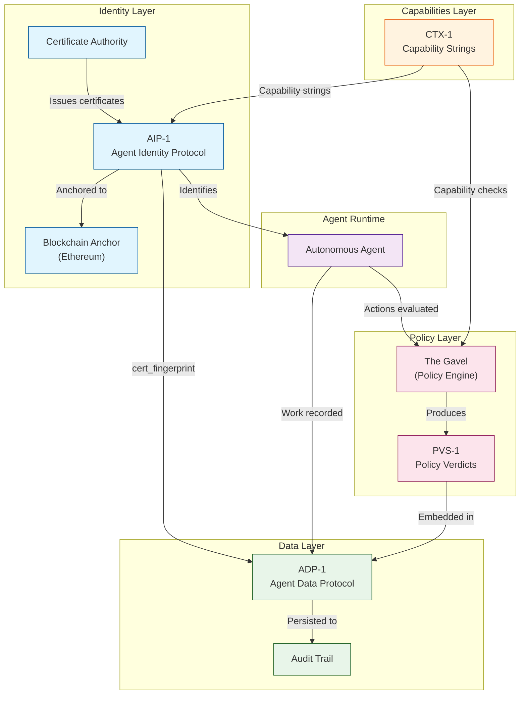

[](https://github.com/chrisbaber/agent-control-specs)
[](LICENSE)

# AControlLayer Standards

[](https://specs.acontrollayer.com)
[](LICENSE)
[](https://sepolia.etherscan.io/tx/0x9349d41f0c92d128cbc07e8d4697a92fa7d107b2468c1f2fc0e9a3bc6c74a33a)

## The Problem: An Internet of Un-Governed Agents

As AI agents proliferate, the internet risks becoming a noisy, chaotic, and dangerous place. Without a standardized control layer, agents will struggle to trust one another. The **AControlLayer (ACL)** provides the missing infrastructure for identity, governance, and trust.

## Architecture Overview

The following diagram illustrates how the specifications relate to each other:



### Data Flow

1. **Identity Issuance**: CA issues short-lived X.509 certificates per AIP-1, embedding CTX-1 capability strings
2. **Blockchain Anchoring**: Root CA fingerprint anchored to Ethereum for trustless verification
3. **Agent Authorization**: Agents present certificates for mTLS; verifiers check capabilities
4. **Policy Evaluation**: The Gavel evaluates actions against policies, producing PVS-1 verdicts
5. **Audit Recording**: Agent work recorded via ADP-1, including AIP linkage and policy verdicts

## Quickstart

Want to see the specs in action? Try the interactive validators:

👉 **[specs.acontrollayer.com/validator](https://specs.acontrollayer.com/validator)**

Or validate your implementation programmatically via our API endpoint:

```bash
curl -X POST https://specs.acontrollayer.com/api/validate/adp \
  -H "Content-Type: application/json" \
  -d @your-agent-run.json
```

## Abstract

The AControlLayer (ACL) specifications define open standards for autonomous AI agent identity, data interchange, policy enforcement, and capability management. These specifications enable secure, auditable, and interoperable agent operations across heterogeneous platforms and frameworks.

This repository contains four core specifications:

-   **AIP-1** (Agent Identity Protocol): Cryptographic agent identification via short-lived X.509 certificates
-   **ADP-1** (Agent Data Protocol): Framework-agnostic format for recording agent work
-   **PVS-1** (Policy Verdict Schema): Structured policy enforcement decisions
-   **CTX-1** (Capability & Trust eXtensions): Standard capability string vocabulary

---

## Specification Overview

| Spec                      | Title                         | Category     | Status | Description                                                      |
| ------------------------- | ----------------------------- | ------------ | ------ | ---------------------------------------------------------------- |
| [AIP-1](specs/AIP-1.md)   | Agent Identity Protocol       | Identity     | RFC    | X.509 certificates with custom OIDs, blockchain-anchored root CA |
| [ADP-1](specs/ADP-1.md)   | Agent Data Protocol           | Data         | RFC    | Action-Observation-Reflection format for agent runs              |
| [PVS-1](specs/PVS-1.md)   | Policy Verdict Schema         | Policy       | RFC    | JSON structure for policy engine verdicts                        |
| [CTX-1](specs/CTX-1.md)   | Capability & Trust eXtensions | Capabilities | RFC    | Capability string naming conventions                             |
| [SPEC-0](specs/SPEC-0.md) | Specification Process         | Meta         | RFC    | Governance and document structure                                |

---

## Implementation Guide

### Platform Developer Checklist

| Step | Task                                         | Spec Reference      | Notes                              |
| ---- | -------------------------------------------- | ------------------- | ---------------------------------- |
| 1    | Generate Root CA and Intermediate CA         | AIP-1 Section 4.1   | RSA-4096 or ECDSA P-384            |
| 2    | Anchor Root CA fingerprint to blockchain     | AIP-1 Section 4.1   | Ethereum mainnet or Sepolia        |
| 3    | Implement certificate issuance with AIP OIDs | AIP-1 Section 3.1.2 | All 7 custom extensions            |
| 4    | Define capability vocabulary                 | CTX-1 Section 3-4   | Reserved prefixes                  |
| 5    | Implement certificate verification           | AIP-1 Section 4.2   | Chain, OIDs, environment, audience |
| 6    | Integrate policy engine                      | PVS-1 Section 3     | PVS-1 compliant verdicts           |
| 7    | Emit ADP-1 records                           | ADP-1 Section 3     | AIP fingerprint and verdicts       |

### Security Team Verification

```bash
# View certificate details and AIP extensions
openssl x509 -in agent.crt -text -noout

# Verify certificate chain
openssl verify -CAfile root-ca.crt -untrusted intermediate-ca.crt agent.crt

# Extract AIP OID values (Capability-Set)
openssl x509 -in agent.crt -text -noout | grep -A1 "1.3.6.1.4.1.59999.1.4"

# Calculate Root CA fingerprint for blockchain verification
openssl x509 -in root-ca.crt -pubkey -noout | openssl sha256

# Verify certificate validity period
openssl x509 -in agent.crt -noout -dates
```

### Compliance Audit Points

| Audit Point            | Method                 | Expected Result        |
| ---------------------- | ---------------------- | ---------------------- |
| Certificate Lifetime   | `notBefore`/`notAfter` | ≤15 minutes            |
| Blockchain Anchor      | Query Ethereum         | Hash matches on-chain  |
| Capability Constraints | Parse `Capability-Set` | Authorized only        |
| Environment Isolation  | `AIP-Environment` OID  | Matches deployment     |
| Policy Verdicts        | ADP-1 audit trail      | All outputs have PVS-1 |
| Tenant Isolation       | `Tenant-ID` OID        | Correct tenant scope   |

---

## Trustless Verification

Identity roots are anchored on Ethereum for immutability.

| Network               | Status     | Root TX                                                              |
| :-------------------- | :--------- | :------------------------------------------------------------------- |
| **Sepolia (Testnet)** | 🟢 Active  | `0x9349d41f0c92d128cbc07e8d4697a92fa7d107b2468c1f2fc0e9a3bc6c74a33a` |
| **Mainnet**           | 🟡 Pending | _Scheduled for Q1 2026 Release_                                      |

## Roadmap

| Status | Quarter | Milestone                                         |
| :----: | :-----: | :------------------------------------------------ |
|   ✅   | Q4 2025 | Core specs published (AIP-1, ADP-1, PVS-1, CTX-1) |
|   ✅   | Q4 2025 | Interactive validators launched                   |
|   🟡   | Q1 2026 | Mainnet blockchain anchor                         |
|   🟡   | Q1 2026 | Reference implementation (ACL) open-sourced       |
|   ⚪   | Q2 2026 | Multi-language SDKs (Python, TypeScript, Go)      |

---

## Machine-Readable Resources

| Resource                       | Description                            |
| ------------------------------ | -------------------------------------- |
| [schemas/](schemas/)           | JSON Schema definitions (ADP-1, PVS-1) |
| [examples/](examples/)         | Sample payloads and certificates       |
| [test-vectors/](test-vectors/) | Validation test cases                  |

---

## Versioning

Specifications declare versions in schema identifiers (e.g., `version: "adp-1"`). Breaking changes increment the major version (e.g., `adp-2`). Releases are tagged as `aip-1.0`, `adp-1.0`, etc.

See [CHANGELOG.md](CHANGELOG.md) for version history.

---

## Contributing

See [CONTRIBUTING.md](CONTRIBUTING.md) for guidelines on:

-   Reporting issues and requesting features
-   Submitting changes (errata, minor, major)
-   Style and formatting requirements
-   Review process and timelines

Please read our [Code of Conduct](CODE_OF_CONDUCT.md) before participating.

For security vulnerabilities, see [SECURITY.md](SECURITY.md).

---

## Adoption & Implementation

The reference implementation of these standards is available in the **AControlLayer** platform.

-   **For Enterprise:** [AgentComplianceLayer.com](https://acontrollayer.com) (Governance, Risk & Audit)
-   **For Developers:** [AgentOpsPlatform.com](https://acontrollayer.com) (Build, Debug & Trace)
-   **Reference Codebase:** [agentcontrollayer/acl](https://github.com/chrisbaber/acl) (Private Beta)

---

## License

Copyright 2025 AControlLayer, LLC. Released under the [MIT License](LICENSE).
