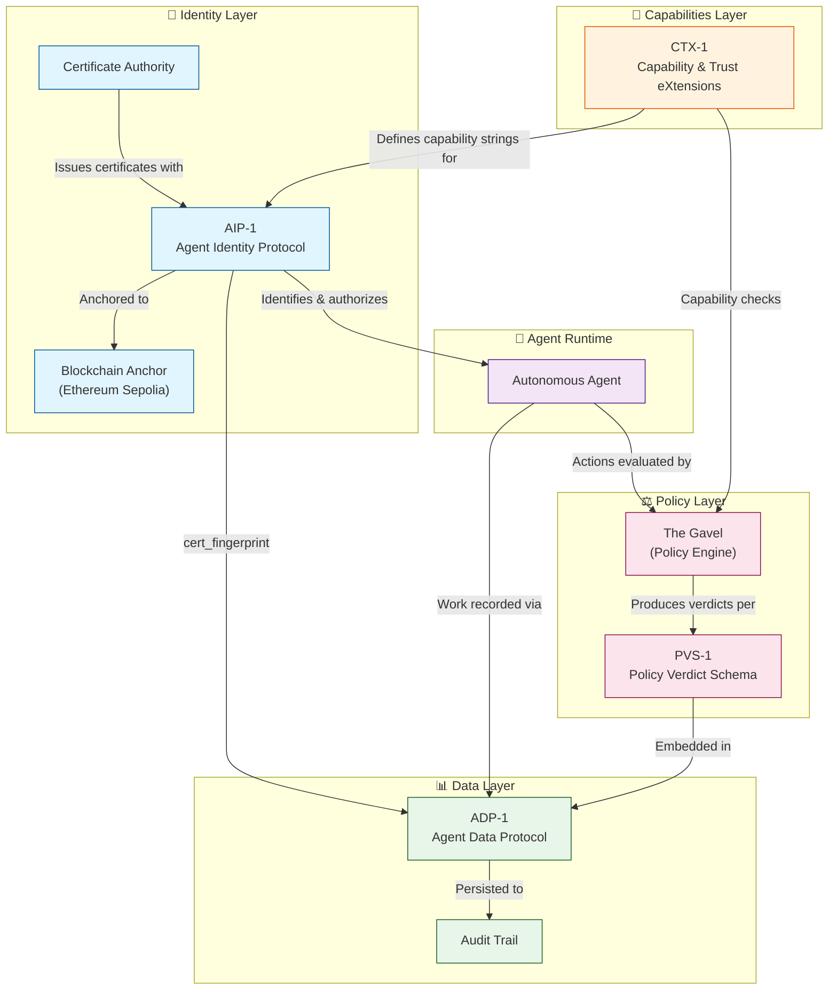

[-blue?style=for-the-badge)](https://github.com/chrisbaber/agent-control-specs)
[](https://opensource.org/licenses/MIT)

# Agent Control Layer Standards

Open specifications for the **Agent Control Layer (ACL)**. These documents define how autonomous AI agents identify themselves, describe their work, and convey policy outcomes in a secure, interoperable manner.

---

## Specification Overview

| Spec | Title | Category | Description |
|------|-------|----------|-------------|
| [AIP-1](specs/AIP-1.md) | Agent Identity Protocol | Identity | Cryptographic agent identification via short-lived X.509 certificates with custom OIDs, anchored to public blockchains for trustless verification. |
| [ADP-1](specs/ADP-1.md) | Agent Data Protocol | Data | Framework-agnostic wire format for agent work: Action → Observation → Reflection, enabling cross-framework interoperability. |
| [PVS-1](specs/PVS-1.md) | Policy Verdict Schema | Policy | Standard JSON structure for policy enforcement decisions from The Gavel and compatible policy engines. |
| [CTX-1](specs/CTX-1.md) | Capability & Trust eXtensions | Capabilities | Common vocabulary and naming conventions for capability strings used in AIP/ADP. |

---

## Architecture

The following diagram illustrates how the specifications relate to each other:



### Data Flow Summary

1. **Identity Issuance**: The CA issues short-lived X.509 certificates per AIP-1, embedding capability strings defined by CTX-1
2. **Blockchain Anchoring**: Root CA fingerprint is anchored to Ethereum for trustless verification
3. **Agent Authorization**: Agents present certificates for mTLS authentication; verifiers check capabilities
4. **Policy Evaluation**: The Gavel evaluates agent actions against policies, producing PVS-1 verdicts
5. **Audit Recording**: All agent work is recorded via ADP-1, including AIP linkage and policy verdicts

---

## How to Implement

### Platform Developer Checklist

| Step | Task | Relevant Spec | Notes |
|------|------|---------------|-------|
| 1 | Generate Root CA and Intermediate CA | AIP-1 §2.2 | Use RSA-4096 or ECDSA P-384 |
| 2 | Anchor Root CA fingerprint to blockchain | AIP-1 §2.2.1 | Ethereum mainnet or Sepolia for testing |
| 3 | Implement certificate issuance with AIP OIDs | AIP-1 §2.1.2 | Include all 7 custom extensions |
| 4 | Define capability vocabulary | CTX-1 §2-3 | Use reserved prefixes: `agent:`, `tenant:`, `perm:` |
| 5 | Implement certificate verification | AIP-1 §2.2.2 | Validate chain, OIDs, environment, audience |
| 6 | Integrate policy engine (The Gavel) | PVS-1 §2 | Return PVS-1 compliant verdicts |
| 7 | Emit ADP-1 records for agent runs | ADP-1 §2.1-2.2 | Include AIP fingerprint and policy verdicts |

### Security Team Verification Commands

```bash
# View certificate details and AIP extensions
openssl x509 -in agent.crt -text -noout

# Verify certificate chain
openssl verify -CAfile root-ca.crt -untrusted intermediate-ca.crt agent.crt

# Extract AIP OID values (example: Capability-Set)
openssl x509 -in agent.crt -text -noout | grep -A1 "1.3.6.1.4.1.59999.1.4"

# Calculate Root CA fingerprint for blockchain verification
openssl x509 -in root-ca.crt -pubkey -noout | openssl sha256

# Verify certificate validity period (should be ≤15 minutes)
openssl x509 -in agent.crt -noout -dates

# Check certificate against environment/audience requirements
openssl x509 -in agent.crt -text -noout | grep -E "59999\.1\.(6|7)"
```

### Compliance Officer Audit Points

| Audit Point | Verification Method | Expected Result |
|-------------|---------------------|-----------------|
| Certificate Lifetime | Check `notBefore`/`notAfter` | ≤15 minutes (recommended: 5 min) |
| Blockchain Anchor | Query Ethereum for Root CA hash | Hash matches on-chain record |
| Capability Constraints | Parse `Capability-Set` OID | Only authorized capabilities present |
| Environment Isolation | Check `AIP-Environment` OID | Matches deployment environment |
| Policy Verdicts | Review ADP-1 audit trail | All agent outputs have PVS-1 verdicts |
| Audit Completeness | Verify ADP-1 run records | All runs have `cert_fingerprint` and `steps` |
| Tenant Isolation | Verify `Tenant-ID` OID | Certificates scoped to correct tenant |

---

## Trustless Verification

Identity roots are anchored on Ethereum for immutability.

| Network | Status | Root TX |
| :--- | :--- | :--- |
| **Sepolia (Testnet)** | 🟢 Active | [`0x9349d41f0c92d128cbc07e8d4697a92fa7d107b2468c1f2fc0e9a3bc6c74a33a`](https://sepolia.etherscan.io/tx/0x9349d41f0c92d128cbc07e8d4697a92fa7d107b2468c1f2fc0e9a3bc6c74a33a) |
| **Mainnet** | 🟡 Pending | *Scheduled for Q1 2026 Release* |

---

## Versioning

Specs declare their version in examples (e.g., `version: "adp-1"`). Breaking changes will bump the major version (e.g., `adp-2`). Tag releases in this repo follow the pattern `aip-1.0`, `adp-1.0`, etc.

---

## Contributing

We welcome contributions from the community! Here's how to get involved:

- **Questions & Discussion**: [Open an issue](https://github.com/chrisbaber/agent-control-specs/issues) for questions, compatibility notes, or implementation feedback
- **Errata & Clarifications**: Submit a PR for corrections or clarifications (keep scope tight)
- **New Features**: Propose new features by opening an issue first; major changes should target future spec versions
- **Implementations**: Share your implementation experience to help improve the specs

These specifications are designed to be implementation-agnostic. Reference them directly or mirror them into your own systems.

---

## Related Resources

| Resource | Description |
|----------|-------------|
| [specs/README.md](specs/README.md) | Quick index and publishing guidance |
| [LM Review Materials](specs/) | Requests and responses from external model reviewers |

The reference implementation lives in the private ACL codebase; this repo is the public spec mirror for anyone to adopt.

---

## Adoption & Implementation

The reference implementation of these standards is available in the **Agent Control Layer** platform.

* **Enterprise:** [AgentComplianceLayer.com](https://agentcompliancelayer.com) (Governance & Audit)
* **Developers:** [AgentOpsPlatform.com](https://agentopsplatform.com) (Build & Debug)

---

## License

Released under the [MIT License](https://opensource.org/licenses/MIT). Copyright 2025 Agent Control Layer.
